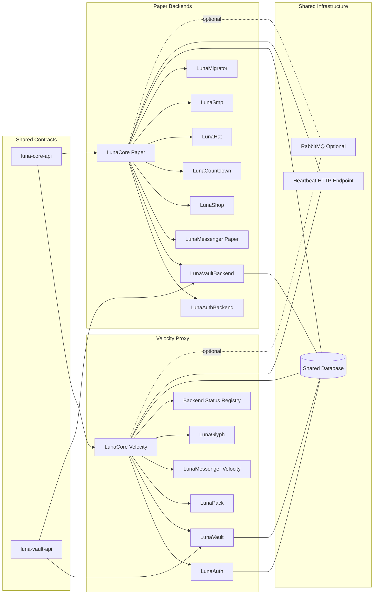
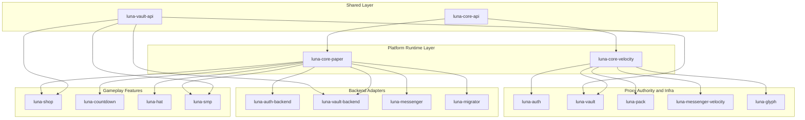
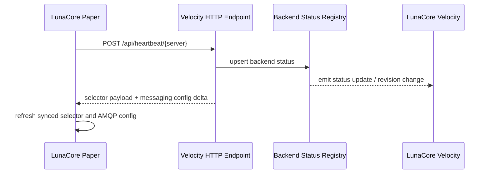
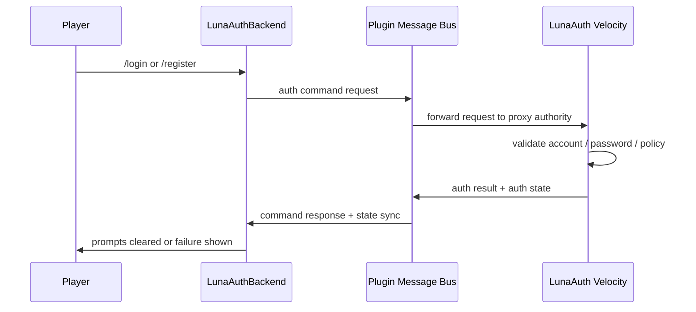
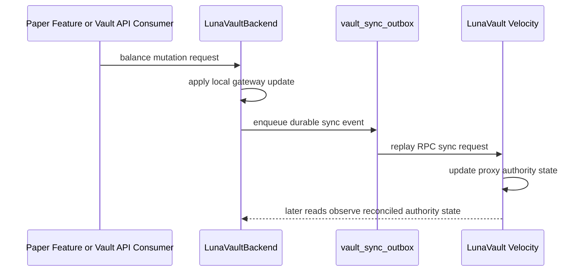
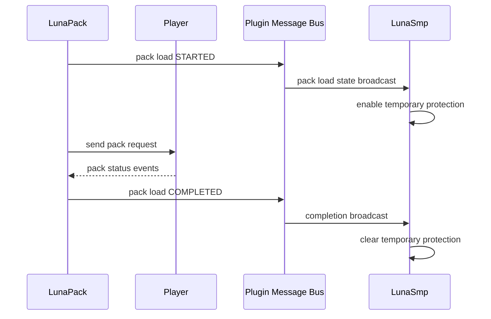

# Luna Plugins

Internal plugin stack for the LUNA Minecraft infrastructure.

This repository is not a generic public plugin bundle. It is the source tree for the proxy-to-backend services that power the LUNA network across Velocity and Paper, with shared contracts in a common API layer.

## Why This Repo Exists

The repo is organized around one architectural constraint: network-level authority lives on the proxy where it needs global visibility, while Paper backends host adapters, enforcement layers, and gameplay-facing consumers.

In practice that means:

- Velocity hosts cross-network authority such as authentication, economy coordination, resource-pack orchestration, and centralized messaging.
- Paper hosts backend runtime services, gameplay integrations, and feature plugins that consume shared services exposed by Luna Core.
- Shared contracts, codecs, storage abstractions, and messaging primitives live in `luna-core-api` and domain API modules such as `luna-vault-api`.

## Active Modules

This README documents only modules that are currently included by [settings.gradle.kts](settings.gradle.kts).

| Module | Platform | Role |
| --- | --- | --- |
| `luna-core-api` | Shared API | Cross-platform contracts, database abstractions, messaging, heartbeat models, logging, UI helpers |
| `luna-core-paper` | Paper | Shared backend runtime, service container, DB/bootstrap layer, heartbeat publisher, Paper integrations |
| `luna-core-velocity` | Velocity | Shared proxy runtime, heartbeat ingress, backend registry, selector config, proxy command/messaging infrastructure |
| `luna-vault-api` | Shared API | Economy contracts, money types, repositories, RPC payload types |
| `luna-vault` | Velocity | Network-wide economy authority and primary source of truth |
| `luna-vault-backend` | Paper | Vault bridge, backend economy gateway, PlaceholderAPI provider, backend sync adapter |
| `luna-pack` | Velocity | Resource-pack orchestration, player pack session tracking, built-in pack serving, backend state broadcast |
| `luna-glyph` | Velocity | Dynamic glyph/font-pack support for proxy-side text rendering and pack integration |
| `luna-shop` | Paper | Shop feature consuming LunaVault or Vault economy providers |
| `luna-countdown` | Paper | Countdown/event feature plugin built on Luna Core |
| `luna-hat` | Paper | Cosmetic hat feature plugin built on Luna Core |
| `luna-smp` | Paper | SMP utilities, tool repair, farm protection, and pack-load protection integration |
| `luna-messenger` | Paper | Backend messaging gateway for chat context capture and player-facing messenger features |
| `luna-messenger-velocity` | Velocity | Central messaging hub for network chat, presence, moderation, and Discord bridge routing |
| `luna-auth` | Velocity | Authentication authority, account storage, password verification, mixed-mode routing |
| `luna-auth-backend` | Paper | Backend auth restrictions, login/register command forwarding, pre-auth spawn and prompt flow |
| `luna-migrator` | Paper | UUID/auth migration support plugin for the LUNA stack |

## Server Architecture

At runtime the stack is split into three layers:

- Shared contracts and codecs in the API modules.
- Proxy authority services on Velocity.
- Backend adapters and gameplay consumers on Paper.



### Core Runtime Split

`luna-core-paper` is the backend-side bootstrap layer. It initializes configuration, database connectivity, migrations, plugin messaging, heartbeat publishing, the Paper service container, and backend-side selector support. The shared backend container is exposed through `LunaCore.services()`.

`luna-core-velocity` is the proxy-side bootstrap layer. It owns the HTTP ingress used by backend heartbeats, backend status tracking, selector configuration, shared database provisioning, placeholder integration, and proxy-side plugin messaging.

## Plugin Architecture

### Layered Dependency View



### Authority Boundaries

- `luna-auth` is the authentication authority. `luna-auth-backend` does not verify passwords locally; it forwards commands and consumes auth state/results.
- `luna-vault` is the long-lived network economy authority. `luna-vault-backend` exposes backend integrations and currently performs local gateway work with durable sync back to the proxy authority.
- `luna-pack` is proxy-owned because resource-pack decisions depend on network routing and player transitions.
- `luna-messenger-velocity` is the central hub for network chat and Discord routing, while `luna-messenger` captures backend-local context and player interaction.

## Message Flows

### Backend Heartbeat Flow



### Auth Command Flow



### Vault Sync Flow



### Resource-Pack Protection Flow



## Build and Packaging

### Requirements

- Java 21
- Gradle wrapper from this repository

### Common Commands

```bash
./gradlew build
./gradlew shadowJar
./gradlew :luna-core-paper:build
./gradlew :luna-auth:build
```

On Windows use `gradlew.bat` instead of `./gradlew`.

### Output Layout

Shadow jars are written to the root `output/` directory:

- `output/paper/` for Paper targets
- `output/velocity/` for Velocity targets

Artifact naming follows the root Gradle convention:

- `{moduleBaseName}-paper-all.jar`
- `{moduleBaseName}-velocity-all.jar`

Examples:

- `luna-core-paper-all.jar`
- `luna-auth-velocity-all.jar`
- `luna-vault-backend-paper-all.jar`

API-only modules such as `luna-core-api` and `luna-vault-api` are not published as shadow jars.

### Metadata Conventions

- Paper plugins declare metadata through `paper-plugin.yml`.
- Velocity plugins declare metadata through `@Plugin` and generated `BuildConstants` templates.
- Shared build behavior such as toolchain setup, resource version expansion, and jar naming lives in [build.gradle.kts](build.gradle.kts).

## Developer Workflow

### 1. Understand the Active Graph

Start with:

- [settings.gradle.kts](settings.gradle.kts)
- [build.gradle.kts](build.gradle.kts)
- [gradle/libs.versions.toml](gradle/libs.versions.toml)

Those files define which modules exist, which platform each module targets, which dependencies are available, and how artifacts are produced.

### 2. Follow the Runtime Boundary Rules

- Put reusable contracts and helpers in `luna-core-api`.
- Put backend runtime code in `luna-core-paper` or Paper feature modules.
- Put proxy authority and network-wide logic in Velocity modules.
- If logic will be reused across multiple features, move it into a shared module instead of duplicating it.

### 3. Use the Existing Build Conventions

- Java toolchain and release target are fixed at 21.
- Most runtime plugins are assembled via `shadowJar`.
- Velocity modules that use generated constants already follow the template pattern under `src/main/templates/`.
- Player-facing runtime text in plugins is Vietnamese, but repository-level documentation should stay English.

## Key Integrations

### Shared Database

Both proxy and backend runtimes expose database configuration. The stack supports SQLite, MySQL, and MariaDB through the shared database layer.

Relevant entrypoints:

- [luna-core-paper/src/main/resources/config.yml](luna-core-paper/src/main/resources/config.yml)
- [luna-core-velocity/src/main/resources/config.yml](luna-core-velocity/src/main/resources/config.yml)

### Optional RabbitMQ Transport

Plugin messaging can be augmented with RabbitMQ. The transport is optional and configured through the shared `messaging.rabbitmq` blocks in the core configs.

### Paper Runtime Dependencies

`luna-core-paper` expects several server-side integrations to exist at runtime, including Spark, Vault, LuckPerms, PlaceholderAPI, and ProtocolLib. See [luna-core-paper/src/main/resources/paper-plugin.yml](luna-core-paper/src/main/resources/paper-plugin.yml).

## Entry Points Worth Reading First

If you are new to the codebase, start here:

- [luna-core-paper/src/main/java/dev/belikhun/luna/core/paper/LunaCorePlugin.java](luna-core-paper/src/main/java/dev/belikhun/luna/core/paper/LunaCorePlugin.java)
- [luna-core-velocity/src/main/java/dev/belikhun/luna/core/velocity/LunaCoreVelocityPlugin.java](luna-core-velocity/src/main/java/dev/belikhun/luna/core/velocity/LunaCoreVelocityPlugin.java)
- [luna-auth/src/main/java/dev/belikhun/luna/auth/LunaAuthVelocityPlugin.java](luna-auth/src/main/java/dev/belikhun/luna/auth/LunaAuthVelocityPlugin.java)
- [luna-auth-backend/src/main/java/dev/belikhun/luna/auth/backend/LunaAuthBackendPlugin.java](luna-auth-backend/src/main/java/dev/belikhun/luna/auth/backend/LunaAuthBackendPlugin.java)
- [luna-vault/src/main/java/dev/belikhun/luna/vault/LunaVaultVelocityPlugin.java](luna-vault/src/main/java/dev/belikhun/luna/vault/LunaVaultVelocityPlugin.java)
- [luna-vault-backend/src/main/java/dev/belikhun/luna/vault/backend/LunaVaultBackendPlugin.java](luna-vault-backend/src/main/java/dev/belikhun/luna/vault/backend/LunaVaultBackendPlugin.java)
- [luna-pack/src/main/java/dev/belikhun/luna/pack/LunaPackLoaderPlugin.java](luna-pack/src/main/java/dev/belikhun/luna/pack/LunaPackLoaderPlugin.java)
- [luna-messenger-velocity/src/main/java/dev/belikhun/luna/messenger/velocity/LunaMessengerVelocityPlugin.java](luna-messenger-velocity/src/main/java/dev/belikhun/luna/messenger/velocity/LunaMessengerVelocityPlugin.java)

## Further Docs

- [LunaPlaceholders.md](LunaPlaceholders.md) for PlaceholderAPI, MiniPlaceholders, and TAB placeholder references
